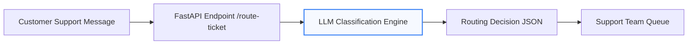

# AI Support Ticket Router

A lightweight AI automation service that classifies and routes customer support tickets using an LLM.

This project demonstrates how AI can be integrated into operational workflows to automatically categorize incoming support requests.

---

## Problem

Support teams receive large volumes of messages that must be manually triaged and routed to the correct department.

This project automates that process by using an LLM to:

* classify the issue
* assign priority
* route to the correct operational team

---

## Architecture

## Architecture Diagram




Customer Message
↓
FastAPI API Endpoint
↓
LLM Classification
↓
Structured Routing Decision (JSON)

---

## Example Request

POST `/route-ticket`

```json
{
  "message": "My order has not arrived and I want a refund."
}
```

---

## Example Response

```json
{
  "routing_result": {
    "department": "customer_support",
    "priority": "high",
    "summary": "Customer is requesting a refund for an order that has not arrived."
  }
}
```

---

## Tech Stack

* Python
* FastAPI
* OpenAI API
* Pydantic
* Uvicorn

---

## Running the Project

Clone the repository.

```
git clone <repo-url>
cd ai-support-ticket-router
```

Create and activate the environment.

```
python3 -m venv venv
source venv/bin/activate
```

Install dependencies.

```
pip install -r requirements.txt
```

Create `.env` file.

```
OPENAI_API_KEY=your_api_key
```

Start the server.

```
uvicorn app:app --reload
```

Open:

```
http://127.0.0.1:8000/docs
```

---

## Use Case

This pattern can be extended to automate workflows such as:

* support ticket routing
* CRM automation
* email classification
* operational alerts

---
## Reliability Improvements

The routing system includes safeguards to ensure reliable automation:

- Structured JSON outputs from the LLM
- Schema validation using Pydantic
- Fallback routing when classification fails

These safeguards ensure consistent routing decisions for downstream support systems.

## Author

Sanmithra Mudigonda 
Munich, Germany

LinkedIn: https://www.linkedin.com/in/sanmithrams/
GitHub: https://github.com/SanmithraMudigonda


AI automation prototype built for Applied AI / Automation engineering portfolios.
